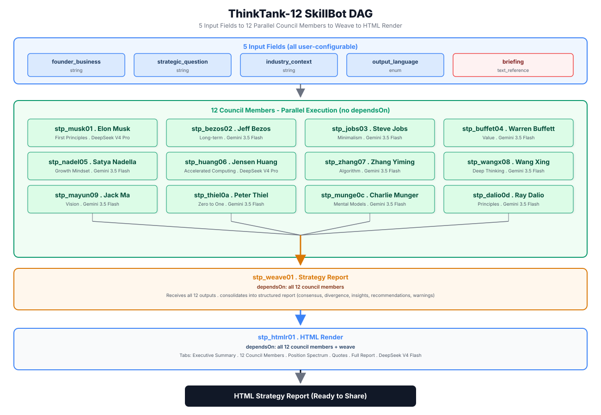
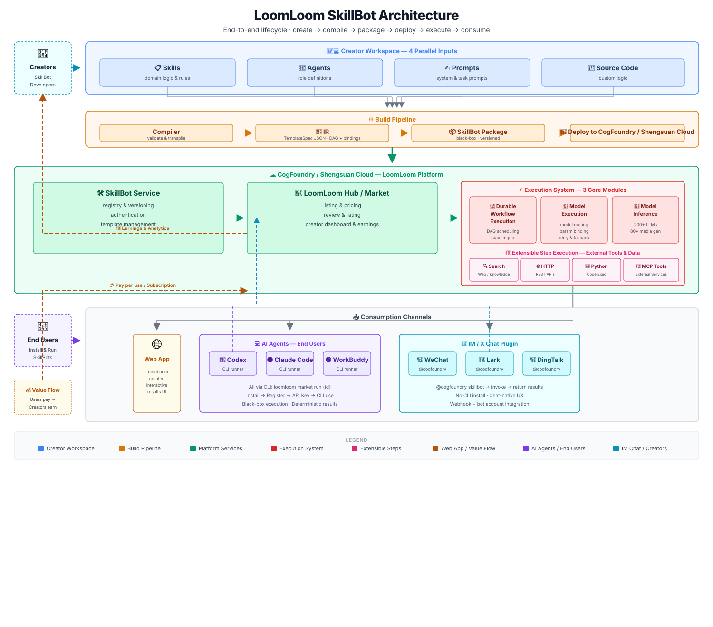

# 顶级智囊团 ThinkTank-12 · 开源版

> 12 位世界顶级商业智囊同时为你出谋划策。LoomLoom 平台首个开源 SkillBot，也是创作者学习构建 AI 技能体的最佳范本。

---

## 这是什么

「顶级智囊团」是一个运行在 [胜算云 LoomLoom](https://shengsuanyun.com/loomloom) 平台上的 **SkillBot（技能体）**。用户输入自己的业务描述、战略问题、行业背景，可选上传会前资料，12 位商业巨擘的 AI 分身会并行分析，最终整合成一份精美的 HTML 战略报告。

它也是 LoomLoom 创作者生态的**教学案例**——完整开源了 TemplateSpec JSON、知识库、DAG 设计思路，任何人可以复制、修改、商用。

> 想创建自己的 SkillBot？阅读 **[创作者教程](CREATOR-TUTORIAL.zh.md)**，从灵感到收入，一步步学会构建爆款技能体。

## 12 位智囊

| | 智囊 | 思维框架 | 擅长领域 |
|---|------|---------|---------|
| ⚡ | 埃隆·马斯克 | 第一性原理 | 技术战略、颠覆式创新 |
| 📦 | 杰夫·贝索斯 | 长期主义 + 客户至上 | 商业模式、长期战略 |
| 🍎 | 史蒂夫·乔布斯 | 极简主义 + 产品直觉 | 产品设计、品牌塑造 |
| 💰 | 沃伦·巴菲特 | 价值投资 + 护城河 | 资本配置、风险管理 |
| ☁️ | 萨提亚·纳德拉 | 成长型思维 + 同理心 | 组织转型、平台生态 |
| 🖥️ | 黄仁勋 | 加速计算 + 平台战略 | 技术战略、AI 基础设施 |
| 📐 | 张一鸣 | 算法驱动 + 延迟满足 | 产品战略、全球化 |
| 🍚 | 王兴 | 深度思考 + 无限游戏 | 竞争战略、平台经济 |
| 🎤 | 马云 | 愿景驱动 + 生态思维 | 商业模式创新、市场开拓 |
| 🔮 | 彼得·蒂尔 | 从 0 到 1 + 垄断理论 | 颠覆式创新、竞争策略 |
| 🧠 | 查理·芒格 | 多元思维模型 + 逆向思维 | 决策框架、风险识别 |
| 🌉 | 雷·达里奥 | 原则驱动 + 极度透明 | 系统化决策、组织原则 |

## 输入字段：全部可编程设置

| 字段 | 类型 | 说明 |
|------|------|------|
| 创业业务描述 | string | 产品/服务、目标用户、当前阶段 |
| 核心战略问题 | string | 1-3 个具体问题（即会议主题） |
| 行业背景 | string | 市场规模、竞争格局、技术趋势 |
| 输出语言 | enum | 中文 / English |
| 会前资料 | text_reference | 上传 .md/.txt 背景材料，智囊会前阅读 |

## SkillBot DAG



```
输入（5 个字段）
  ├── 业务描述 (founder_business)
  ├── 核心战略问题 (strategic_question)
  ├── 行业背景 (industry_context)
  ├── 输出语言 (output_language)
  └── 会前资料 (briefing) → 通过 upstreamBindings 注入每个智囊的 reference 端口

        ↓ 12 个智囊并行执行（不同模型，独立分析）

  ┌─────────────────────────────────────┐
  │  stp_weave01 → 战略汇总报告        │
  │  dependsOn: 所有 12 个智囊          │
  │  模型: DeepSeek V4 Pro             │
  └─────────────────────────────────────┘
        ↓

  ┌─────────────────────────────────────┐
  │  stp_htmlr01 → HTML 报告渲染       │
  │  dependsOn: 12 个智囊 + weave       │
  │  模型: DeepSeek V4 Flash           │
  └─────────────────────────────────────┘
```


## LoomLoom Architecture



ThinkTank-12 运行在 LoomLoom 平台上，整个生命周期的架构如上图所示：

- **Creator Workspace**: Skills、Agents、Prompts、Source Code 四个输入并行，通过 Compiler 编译为 IR（TemplateSpec JSON）
- **Build Pipeline**: IR → SkillBot Package → Deploy to CogFoundry / Shengsuan Cloud
- **Platform**: SkillBot Service（注册 & 版本管理）→ LoomLoom Hub / Market（上架 & 定价）
- **Execution System**: 包含 Durable Workflow Execution、Model Execution、Model Inference 三大核心模块，以及 Extensible Step Execution（Search / HTTP / Python / MCP）可选扩展
- **Consumption**: Web App、AI Agents（Codex / Claude Code / Workbuddy）、IM/X Chat Plugin 多渠道分发
- **Value Flow**: 用户付费 → 平台分账 → 创作者获得收益
## 文件说明

```
thinktank-12-open-source/
├── template.json          # TemplateSpec 完整 JSON（可直接部署）
├── knowledge-base.md      # 12 位智囊的思维框架知识库
├── attribution.md         # 智囊发言归属分析
├── input.example.json     # 示例输入
├── CREATOR-TUTORIAL.md    # 创作者教程：从零构建爆款 SkillBot
├── LICENSE                # MIT
└── README.md             # 本文件
```

## 快速开始

```bash
# 1. 安装 LoomLoom CLI，注册胜算云获取 API Key
# 2. 本地校验
loomloom template-spec check ./template.json

# 3. 创建为你的私有模板
loomloom template-spec create ./template.json

# 4. 创建新版本
loomloom template-spec create-version <template-id> ./template.json

# 5. 上架到 Market
loomloom listing publish <template-id> \
  --template-version-id <version-id> \
  --display-name "顶级智囊团" \
  --description "12 位商业巨擘同时为你的战略问题出谋划策" \
  --task-fixed-fee "1"
```

## 开源许可

MIT License — 欢迎复制、修改、商用。如果你基于此模板做出了有趣的 SkillBot，欢迎告诉我们。

## 关于 LoomLoom

[胜算云 LoomLoom](https://shengsuanyun.com/loomloom) 是一个 AI 技能体交易平台，聚合了 200+ 大模型和 80+ 多媒体生成模型。创作者用 JSON 定义 DAG 工作流，上传后作为黑盒 SkillBot 上架销售，使用者在 Codex、Claude Code、Workbuddy 等 AI Agent 中通过 CLI 购买使用。

- 胜算云官网：https://shengsuanyun.com/loomloom
- LoomLoom GitHub：[Cogfoundry-ai/loomloom](https://github.com/Cogfoundry-ai/loomloom)
